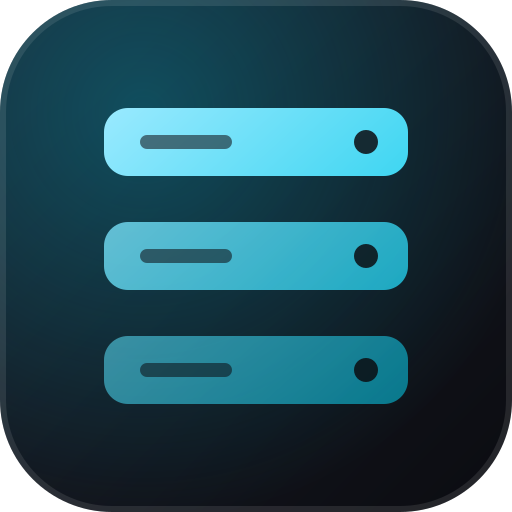

<div align="center">



# back-template-go

**Un starter de API en Go con Fiber, GORM y Postgres, auth JWT y una imagen Docker distroless.**<br>
Refresh tokens rotativos, rate limiting, logging estructurado y pruebas contra una base de datos real, todo integrado.

[](https://github.com/obrenoalvim/back-template-go/actions/workflows/ci.yml)
[](LICENSE)
[](https://github.com/obrenoalvim/back-template-go/stargazers)
[](#stack)
[](#base-de-datos)
[](#docker)

[English](README.md) · [Português](README.pt.md) · **Español**

[Stack](#stack) · [Primeros pasos](#primeros-pasos-docker-recomendado) · [Auth](#auth) · [Pruebas](#pruebas) · [Familia de templates](#la-familia-de-templates) · [Preguntas frecuentes](#preguntas-frecuentes)

</div>

---

Template starter de backend en Go: Fiber, GORM + Postgres + golang-migrate, auth JWT con refresh tokens rotativos y revocables, rate limiting, logging estructurado y Docker, todo integrado y probado de punta a punta. Comparte el mismo contrato de endpoints y el mismo formato de error que los otros templates de backend, con otro stack.

## Contenido

- [Stack](#stack)
- [Estructura del proyecto](#estructura-del-proyecto)
- [Primeros pasos (Docker)](#primeros-pasos-docker-recomendado)
- [Primeros pasos (sin Docker)](#primeros-pasos-sin-docker)
- [Variables de entorno](#variables-de-entorno)
- [Auth](#auth)
- [Roles](#roles)
- [Formato de error](#formato-de-error)
- [Base de datos](#base-de-datos)
- [Ejemplo de recurso CRUD](#ejemplo-de-recurso-crud)
- [Pruebas](#pruebas)
- [CI/CD](#cicd)
- [Docker](#docker)
- [Scripts](#scripts)
- [Usar esto como template](#usar-esto-como-template)
- [Notas de diseño y trampas](#notas-de-diseño-y-trampas)

## Stack

- [Go](https://go.dev) 1.25
- [Fiber](https://gofiber.io) v2: router y middleware al estilo Express, el framework web más usado de Go
- [GORM](https://gorm.io) + [pgx](https://github.com/jackc/pgx) (vía `gorm.io/driver/postgres`) + [golang-migrate](https://github.com/golang-migrate/migrate): esquema versionado en archivos SQL, embebidos en el binario con `go:embed` y aplicados automáticamente al arrancar
- [Postgres](https://www.postgresql.org)
- Auth JWT ([golang-jwt/jwt](https://github.com/golang-jwt/jwt)): access token de vida corta + refresh token de vida más larga, rotado y persistido en el servidor para poder revocarlo (`internal/models/refresh_token.go`)
- `golang.org/x/crypto/bcrypt`: hash de contraseñas
- El middleware [`limiter`](https://docs.gofiber.io/api/middleware/limiter) incluido en Fiber: rate limiting (5 req/min/IP en login/register), sin dependencias extra
- Correo con `net/smtp`, con un fallback a consola en desarrollo (`internal/mail`): no hace falta configurar nada para probar el flujo de auth en local
- `log/slog` (biblioteca estándar): logging estructurado, texto legible en desarrollo y JSON en producción
- Un formato consistente `{"error": {"code", "message", "details"}}` en todos los endpoints (`internal/apierror`)
- [go-playground/validator](https://github.com/go-playground/validator): validación de requests con tags de struct, con nombres de campo JSON en el detalle de los errores
- El `testing` de Go + [testify](https://github.com/stretchr/testify): pruebas unitarias y de integración contra un Postgres real (con `fiber.App.Test`, sin base de datos simulada)
- [golangci-lint](https://golangci-lint.run): meta-linter; hook nativo de git pre-commit (`gofmt` + `golangci-lint`), sin herramientas de otros lenguajes
- Docker + docker-compose: build multi-stage, binario estático con `CGO_ENABLED=0` sobre una imagen de runtime **distroless nonroot**
- CI con GitHub Actions: build, lint, vet y pruebas contra un contenedor de servicio de Postgres real, y build de la imagen Docker
- `/health` para el healthcheck de Docker (más un pequeño binario `healthcheck` independiente, porque distroless no tiene shell ni curl)

## Estructura del proyecto

```
cmd/
  api/main.go                 # entrypoint: config, migrate, connect, server.New, listen
  healthcheck/main.go          # standalone binary for the Dockerfile HEALTHCHECK
internal/
  config/                        # env-based config, sane defaults
  server/                         # server.New: wires every route; shared by main.go and tests
  db/                              # GORM connection + embedded golang-migrate migrations
    migrations/                     # *.up.sql / *.down.sql: commit these
  models/                           # User, RefreshToken, Note (GORM)
  apierror/                         # ApiError + Fiber ErrorHandler → {"error": {...}} shape, validation binding
  auth/                             # JWT, bcrypt, RequireAuth/RequireAdmin middleware, /auth/* handlers
  account/                          # /account/* handlers
  admin/                            # /admin/users, /admin/notes handlers
  diagnostics/                      # QueryCounter (test-only GORM plugin, N+1 guard)
  notes/                            # /api/notes/* handlers (reference CRUD)
  mail/                             # SMTP send, console fallback in dev
```

## Primeros pasos (Docker: recomendado)

```bash
cp .env.example .env
# generate a real secret and drop it into .env as JWT_SECRET
openssl rand -base64 32

docker compose up -d --build
```

App: [http://localhost:8083](http://localhost:8083). Postgres se expone en el puerto `5460` del host por defecto (no en el `5432`, para no chocar con una instalación local de Postgres). Las migraciones corren solas al iniciar el contenedor.

## Primeros pasos (sin Docker)

Requiere una instancia de Postgres y [Go](https://go.dev/doc/install) 1.25+.

```bash
cp .env.example .env   # point DATABASE_URL at your own Postgres
go run ./cmd/api
```

## Variables de entorno

Consulta `.env.example` para la lista completa y comentada.

| Variable                           | Requerida   | Propósito                                                        |
| ------------------------------------ | ----------- | ------------------------------------------------------------------ |
| `DATABASE_URL`                       | sí          | Cadena de conexión de Postgres                                      |
| `JWT_SECRET`                         | sí          | ≥32 caracteres; firma de access/refresh tokens                      |
| `DB_HOST_PORT/NAME/USER/PASSWORD`    | solo Docker | defaults de `docker-compose.yml`, usados para armar `DATABASE_URL`  |
| `ENVIRONMENT`                        | no          | `dev` (logs legibles) o cualquier otro valor (logs JSON); por defecto `dev` |
| `LOG_LEVEL`                          | no          | `debug` o cualquier otro valor (info); por defecto `info`           |
| `MAIL_HOST`/`MAIL_PORT`/`MAIL_USERNAME`/`MAIL_PASSWORD` | no | Envía correo real por SMTP; sin `MAIL_HOST`, los correos se registran en la consola |

`internal/config/config.go` carga estas variables con defaults sensatos. Nada entra en pánico si falta una variable, pero `JWT_SECRET` siempre debe sobrescribirse fuera del desarrollo local.

## Auth

`internal/auth` (todo `/auth/*`, público):

- `POST /auth/register`: 201, cuerpo vacío. 409 si el correo ya está en uso.
- `GET /auth/verify-email?token=...`: 200 vacío. 404 token inválido, 409 expirado.
- `POST /auth/login`: 200, `{accessToken, refreshToken}`. 401 credenciales inválidas o correo sin verificar.
- `POST /auth/refresh`: rota el refresh token (se borra el anterior y se emite uno nuevo). 401 si es inválido, expiró o fue revocado.
- `POST /auth/logout`: 200, idempotente.
- `POST /auth/forgot-password`: siempre 200 (sin filtrar si el usuario existe).
- `POST /auth/reset-password`: 200. 404/409 igual que verify-email.
- `PATCH /account/password`, `DELETE /account` (`internal/account`): autenticados, `Authorization: Bearer <accessToken>`.
- Con rate limit: 5 intentos de register/login cada 60 s por IP (el middleware `limiter` de Fiber, ver `internal/auth/routes.go`).
- `auth.RequireAuth` (`internal/auth/middleware.go`) es el único middleware que usa toda ruta protegida: decodifica y valida el bearer token, así que no hay duplicación por ruta. `auth.RequireAdmin` agrega encima una verificación de rol.

**Los refresh tokens se persisten.** A diferencia de un esquema JWT puramente stateless, el `jti` de cada refresh token se guarda en la tabla `refresh_tokens` para poder revocarlo o rotarlo en el servidor. Hacer logout o refresh borra la fila anterior, así que un refresh token robado no se puede reutilizar tras la rotación.

## Roles

Tipo `Role` (`USER` | `ADMIN`, por defecto `USER`) en `User.Role`. Nunca confíes en un rol que venga en el cuerpo de un request. `GET /admin/users` (`internal/admin`) es el endpoint de referencia solo para admins, protegido por `auth.RequireAdmin`. No hay autopromoción: cámbialo directo en la base para probar en local: `UPDATE users SET role = 'ADMIN' WHERE email = '...';`.

## Formato de error

Toda respuesta de error (validación, auth, no encontrado, no controlado) tiene el mismo envoltorio, producido por `apierror.Handler` (el `ErrorHandler` global de Fiber):

```json
{ "error": { "code": "VALIDATION_ERROR", "message": "Invalid request body", "details": ["email: failed on the 'email' rule"] } }
```

`code` es uno de `VALIDATION_ERROR`, `UNAUTHORIZED`, `FORBIDDEN`, `NOT_FOUND`, `CONFLICT`, `RATE_LIMITED`, `INTERNAL_ERROR`, y coincide a propósito con el formato del resto de la familia de backends, así un template de front-end puede cambiar de backend con cambios mínimos en su manejo de errores.

## Base de datos

El esquema vive en `internal/db/migrations/` (SQL simple, formato golang-migrate) y en `internal/models/` (structs de GORM que lo reflejan, usados para consultar y no para generar el esquema; este template **no** depende de `AutoMigrate` en producción). Después de cambiar el esquema:

```bash
migrate create -ext sql -dir internal/db/migrations -seq add_something
# edit the generated *.up.sql / *.down.sql, then update internal/models/ to match
```

(Requiere la [CLI `migrate`](https://github.com/golang-migrate/migrate#cli-usage) en local solo para generar los nombres de los archivos de migración nuevos. La app aplica las migraciones con la biblioteca embebida, así que no se necesita la CLI en tiempo de ejecución.)

Toda clave foránea hacia `users` usa `ON DELETE CASCADE` desde la primera migración, así que borrar una cuenta elimina automáticamente sus notas y sus refresh tokens (ver [Notas de diseño](#notas-de-diseño-y-trampas)).

## Ejemplo de recurso CRUD

`/api/notes` (`internal/notes`) es una implementación de referencia completa: un request verificado con validator, un modelo GORM que pertenece al usuario autenticado y una respuesta JSON con nombres de campo en camelCase que coinciden con la convención del resto de la familia. Copia esta forma para tu primera funcionalidad real y después elimina `internal/notes` (y borra la tabla `notes` con una migración nueva) cuando ya no necesites la referencia.

## Pruebas

- **Unitarias** (`go test ./internal/auth/...`): hash de contraseñas y ciclo completo de JWT, sin base de datos: `internal/auth/auth_test.go`.
- **De integración** (`go test ./internal/server/...`): `internal/server/server_test.go` recorre todo el flujo register → verify → login → CRUD de notas → refresh → eliminar cuenta a través de `fiber.App.Test()` (en proceso, sin un listener de red real) contra un Postgres real, sin base de datos simulada. Define `TEST_DATABASE_URL` para apuntarla a una base específica (si no, usa `DATABASE_URL` o su valor por defecto).
- **Protección contra N+1 por conteo de consultas** (`go test ./internal/admin/...`): `internal/admin/query_count_test.go` crea una cantidad variable de notas, registra `diagnostics.QueryCounter` (un plugin de GORM que cuenta cada statement SQL ejecutado) en la conexión y verifica que `admin.NotesWithOwners` (la función detrás de `GET /admin/notes`) siempre ejecuta exactamente 1 consulta SQL, con 4 notas o con 8. `NotesWithOwners` usa `Joins("Owner")` de GORM (un único join de SQL) en lugar de cargar el dueño de cada nota en una consulta aparte; si alguien lo cambia por una búsqueda por nota, esta prueba se pone en rojo antes de llegar a producción.
- El CI levanta un contenedor de servicio de Postgres y corre toda la suite (`go test ./...`) contra él.

## CI/CD

`.github/workflows/ci.yml` corre dos jobs en cada push/PR:

1. **build**: `go build`, `gofmt -l` (falla con archivos sin formatear), `golangci-lint run`, `go vet`, `go test ./...`, todo contra un contenedor de servicio de Postgres real
2. **docker**: construye la imagen Docker de producción (`docker/build-push-action`, sin push) para detectar pronto cualquier rotura del Dockerfile

Dependabot (`.github/dependabot.yml`) revisa los módulos de Go, GitHub Actions y el Dockerfile cada semana.

## Docker

- `Dockerfile`: multi-stage (`build` → `runtime`). La etapa de build compila con `CGO_ENABLED=0` para obtener un binario completamente estático; la etapa de runtime es `gcr.io/distroless/static:nonroot`, sin shell, sin gestor de paquetes, unos 2 MB de base y un usuario sin privilegios por defecto.
- Como distroless no tiene `curl`/`wget`/shell para un `HEALTHCHECK CMD`, `cmd/healthcheck` es un segundo binario de Go muy pequeño (un simple HTTP GET a `/health`) que se compila y se copia en la misma imagen.
- `docker-compose.yml`: `db` (Postgres 17, con healthcheck vía `pg_isready`, puerto `5460` del host por defecto) y `app` (construida desde el Dockerfile, con healthcheck vía el binario `/healthcheck`, espera a que `db` esté sano).

## Scripts

| Comando                          | Propósito                        |
| ----------------------------------- | ----------------------------------- |
| `go run ./cmd/api`                   | Inicia el servidor de desarrollo    |
| `go build ./...`                      | Compila todo                        |
| `go test ./...`                        | Corre las pruebas                   |
| `gofmt -w .`                            | Formato                             |
| `golangci-lint run ./...`                | Lint                                |
| `git config core.hooksPath githooks`      | Una sola vez: activa el hook de pre-commit |
| `docker compose up -d --build`             | Construye e inicia app + Postgres   |
| `docker compose down`                       | Detiene                             |

## Usar esto como template

1. Haz clic en "Use this template" en GitHub
2. `go mod edit -module github.com/<you>/<repo>` y actualiza cada ruta de import (`grep -rl obrenoalvim/back-template-go .` para encontrarlas todas), y actualiza este README
3. `cp .env.example .env` y define un `JWT_SECRET` real
4. `git config core.hooksPath githooks` (una sola vez por clon; el hook de este repo no se instala solo, como sí hace `npm install` con Husky)
5. `docker compose up -d --build` (o el camino sin Docker de arriba)
6. Elimina `internal/notes` cuando hayas copiado su patrón para tu propia primera funcionalidad

## Notas de diseño y trampas

- **`ON DELETE CASCADE` en cada FK hacia `users`, desde la primera migración.** Se escribió así desde el principio porque `back-template-fastapi` (construido antes en la misma sesión) salió sin él, y `DELETE /account` falló con un `ForeignKeyViolationError` real en cuanto un usuario tenía notas. Borrar un usuario tiene que propagarse en cascada a nivel de base de datos; el "borrar primero los hijos" en la app es una cosa más que se olvida cuando aparece una tabla hija nueva.
- **`fiber.Ctx.SendStatus` no es "poner el status y dejar el cuerpo vacío".** Rellena el cuerpo con el texto del status (`"Created"`, `"OK"`, ...) siempre que no se haya escrito nada más: un cuerpo literal de 7 bytes donde el resto de la familia de backends devuelve algo realmente vacío. `apierror.Empty(c, status)` (`c.Status(status).Send(nil)`) se usa en todo endpoint que deba devolver una respuesta realmente vacía.
- **Un middleware de logging que lee el status antes de que el error handler lo escriba siempre registra 200.** El `ErrorHandler` configurado de Fiber solo corre cuando toda la cadena de middleware (incluido un middleware de logging que envuelve todo con `c.Next()`) ya devolvió el control al dispatcher externo de Fiber, así que un `status := c.Response().StatusCode()` ingenuo justo después de `c.Next()` lee el status por defecto previo al error. Cada request 4xx/5xx se registraba como 200 hasta que `requestLogger` (`internal/server/server.go`) se cambió para invocar él mismo a `apierror.Handler` cuando `c.Next()` devuelve un error no nulo, antes de leer el status.
- **`go-playground/validator` informa nombres de campo de Go, no de JSON, a menos que le indiques lo contrario.** `fe.Field()` devuelve `"Email"` (el campo del struct) por defecto, no `"email"` (la clave JSON), lo que es inconsistente con todos los otros backends de la familia, que informan el nombre de campo en formato de red. Se corrigió con `validate.RegisterTagNameFunc` en `internal/apierror/bind.go`.
- **Las migraciones están embebidas (`go:embed`), no se leen del disco en tiempo de ejecución.** La imagen de runtime distroless no tiene acceso al sistema de archivos para un directorio `migrations/` distribuido por separado, así que `internal/db/db.go` embebe `internal/db/migrations/*.sql` directamente en el binario compilado con `//go:embed all:migrations`. `go build` produce un único artefacto autocontenido, sin archivos externos que copiar a la imagen Docker aparte del propio binario.

---

## Preguntas frecuentes

**¿Qué framework web y qué ORM usa?**
[Fiber](https://gofiber.io) v2 para rutas y middleware, y [GORM](https://gorm.io) con el driver pgx para Postgres. Las migraciones vienen de [golang-migrate](https://github.com/golang-migrate/migrate).

**¿Cómo corren las migraciones?**
Son archivos SQL simples embebidos en el binario con `go:embed` y se aplican automáticamente al arrancar. Solo necesitas la CLI `migrate` en local para generar los nombres de los archivos de migración nuevos.

**¿Por qué una imagen distroless?**
El binario es estático (`CGO_ENABLED=0`) y corre sobre `gcr.io/distroless/static:nonroot`: sin shell, sin gestor de paquetes y con un usuario sin privilegios por defecto. Como no hay `curl` para un healthcheck, un segundo binario de Go muy pequeño hace el HTTP GET.

**¿Qué puertos usa?**
La app escucha en el `8083`. Postgres se expone en el puerto `5460` del host por defecto, para no chocar con un Postgres local en el `5432`.

**¿Cómo evita las consultas N+1?**
Una prueba registra un plugin de GORM que cuenta cada statement SQL y verifica que `GET /admin/notes` siempre ejecuta exactamente una consulta. Consulta [Pruebas](#pruebas).

**¿Cómo activo el hook de pre-commit?**
Ejecuta `git config core.hooksPath githooks` una vez por clon.

## La familia de templates

La misma idea con otro stack. Clona uno y empieza a construir.

| Capa | Starter |
|---|---|
| Backend | [Spring Boot](https://github.com/obrenoalvim/back-template-spring) · **Go (este repo)** · [FastAPI](https://github.com/obrenoalvim/back-template-fastapi) · [NestJS](https://github.com/obrenoalvim/back-template-nest) · [Laravel](https://github.com/obrenoalvim/back-template-laravel) · [ASP.NET Core](https://github.com/obrenoalvim/back-template-dotnet) |
| Frontend | [Angular](https://github.com/obrenoalvim/front-template-angular) · [React](https://github.com/obrenoalvim/front-template-react) · [SvelteKit](https://github.com/obrenoalvim/front-template-sveltekit) · [Vue](https://github.com/obrenoalvim/front-template-vue) |
| Full-stack | [Next.js](https://github.com/obrenoalvim/next-template) |

## Licencia

[MIT](LICENSE)

---

<div align="center">

Si esto te ahorró un día de configuración, una ⭐ ayuda a que otras personas desarrolladoras lo encuentren.

<sub>**Temas:** go · golang · fiber · gorm · golang-migrate · postgresql · jwt-authentication · rate-limiting · docker · distroless · rest-api · starter-kit · backend-template</sub>

</div>
